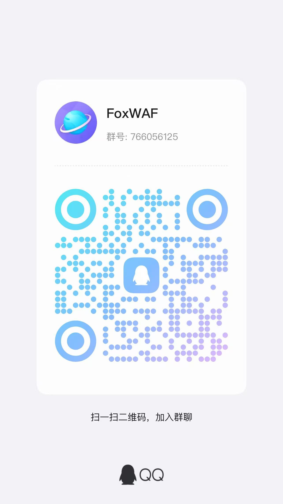

# 🦊 FoxWAF - 高性能 Web 应用防火墙

## 📖 项目介绍

FoxWAF 是一个基于 Go 语言开发的高性能 Web 应用防火墙（WAF）和反向代理系统。它集成了强大的安全防护、访问控制、缓存加速和站点管理等功能，为您的 Web 应用提供全方位的安全保护。

### 核心特性

- **🔒 智能 WAF 防护**：基于规则引擎的 Web 攻击检测和拦截
- **🌐 反向代理**：支持多站点反向代理，自动 SSL/TLS 证书管理
- **🛡️ 访问控制 (ACL)**：灵活的访问控制规则，支持全局和域名级别
- **🚫 CC 攻击防护**：实时检测和拦截 CC 攻击
- **⚡ 静态缓存**：智能静态文件缓存，大幅提升访问速度
- **📊 实时监控**：完善的统计和日志系统，实时监控系统状态
- **🎨 现代化界面**：美观易用的 Web 管理界面，支持暗黑主题

---

## 🚀 快速开始

### 环境要求

- Go 1.19 或更高版本
- Linux/macOS/Windows 操作系统

### 安装步骤

1. **克隆项目**
```bash
git clone [项目地址]
cd foxWaf
```

2. **安装依赖**
```bash
go mod tidy
```

3. **配置项目**

   编辑 `conf.yaml` 配置文件：
```yaml
Server:
  Addr: "0.0.0.0"  # 监听地址
  Port: 8080        # 监听端口
Database:
  Host: "127.0.0.1"
  Port: 3306
  User: "waf"
  Password: "waf"
  DBName: "waf.db"
  encryption_key: "MySecretKey123!@#"
isWriteDbAuto: true        # 是否自动写入攻击日志
secureentry: "fox"         # 管理界面入口路径
```

4. **启动服务**
```bash
go run waf.go
```

或编译后运行：
```bash
go build -o waf waf.go
./waf
```

### 访问管理面板

启动服务后，控制台会显示以下信息：

```
------------------------账户信息---------------------------
账户密码为: fox:fox
-----------------------------------------------------------

=================== 管理面板访问路径 ===================
登录页面地址: http://0.0.0.0:8080/fox
本地访问地址: http://localhost:8080/fox
======================================================
```

**重要提示**：
- 默认用户名：`fox`
- 默认密码：`fox`
- 登录页面路径：`http://您的服务器IP:端口/fox`（`fox` 是 `conf.yaml` 中 `secureentry` 的值）
- 如果监听地址是 `0.0.0.0`，可以使用 `http://localhost:端口/fox` 本地访问

---

## 📚 功能使用说明

### 1. 📊 数据概览

**功能说明**：数据概览页面提供了系统的整体运行状态和关键指标。

**主要功能**：
- **实时统计**：显示总请求数、拦截请求数、缓存命中率等关键指标
- **系统状态**：CPU 使用率、内存使用情况、站点数量等
- **图表展示**：通过可视化图表展示系统运行趋势

**使用方法**：
1. 登录管理面板后，默认进入数据概览页面
2. 页面会自动刷新，实时显示最新数据
3. 可以查看各项指标的变化趋势

---

### 2. 🛡️ ACL 规则管理

**功能说明**：ACL（访问控制列表）规则用于控制允许或阻止特定条件的请求访问。

**主要功能**：
- **添加规则**：创建新的访问控制规则
- **编辑规则**：修改已有规则的配置
- **启用/禁用**：快速启用或禁用规则，无需删除
- **删除规则**：删除不需要的规则

**规则类型**：
- **global（全局规则）**：适用于所有域名的规则
- **host（域名规则）**：仅适用于特定域名的规则

**匹配条件**：
- **IP 地址**：根据客户端 IP 地址进行匹配
- **User-Agent**：根据用户代理字符串进行匹配
- **Referer**：根据来源页面进行匹配
- **路径**：根据请求路径进行匹配
- **国家**：根据 IP 地理位置进行匹配

**使用方法**：
1. 点击左侧菜单的「ACL规则」
2. 点击「添加规则」按钮
3. 填写规则信息：
   - 选择规则类型（全局或域名）
   - 如果选择域名类型，需要填写目标域名
   - 选择匹配条件类型
   - 输入匹配模式（支持正则表达式）
   - 选择动作（允许或阻止）
   - 添加规则描述（可选）
4. 点击「保存」完成添加
5. 规则会立即生效，无需重启服务

**示例**：
- 阻止特定 IP 访问：类型选择「IP地址」，模式填写 `192.168.1.100`，动作选择「阻止」
- 阻止访问 admin 路径：类型选择「路径」，模式填写 `^/admin`，动作选择「阻止」

---

### 3. 🚫 CC 攻击拦截

**功能说明**：CC（Challenge Collapsar）攻击防护用于检测和拦截高频请求攻击。

**主要功能**：
- **CC 攻击统计**：实时显示 CC 攻击拦截情况
- **规则管理**：添加、编辑、删除 CC 防护规则
- **攻击日志**：查看详细的 CC 攻击拦截日志
- **计数器管理**：清空计数器，重置统计数据

**配置参数**：
- **规则名称**：规则的标识名称
- **域名**：应用规则的域名（`*` 表示所有域名）
- **路径**：应用规则的请求路径（可为空表示所有路径）
- **频率限制**：时间窗口内的最大请求次数
- **时间窗口**：统计请求次数的时间范围（秒）
- **防护动作**：拦截请求（目前仅支持拦截）

**使用方法**：
1. 点击左侧菜单的「CC拦截」
2. 查看 CC 攻击统计信息
3. 添加 CC 规则：
   - 点击「添加规则」按钮
   - 填写规则名称、域名、路径
   - 设置频率限制（如：60 秒内超过 100 次请求）
   - 设置时间窗口（如：60 秒）
   - 选择防护动作为「拦截请求」
   - 点击「保存」
4. 查看攻击日志：
   - 在「CC攻击日志」卡片中查看拦截记录
   - 可以按 IP、域名、规则ID、日期范围进行筛选
   - 点击「搜索」按钮进行查询

**示例**：
- 全局 CC 防护：域名填写 `*`，路径留空，频率限制 `100`，时间窗口 `60`（表示 60 秒内超过 100 次请求则拦截）
- 登录接口防护：域名填写 `*`，路径填写 `/login`，频率限制 `10`，时间窗口 `60`（表示 60 秒内登录接口超过 10 次请求则拦截）

---

### 4. ⚡ 缓存管理

**功能说明**：静态文件缓存可以大幅提升网站访问速度，减少服务器负载。

**主要功能**：
- **缓存统计**：查看缓存命中率、缓存大小等统计信息
- **缓存清理**：手动清理缓存，释放存储空间
- **缓存配置**：查看和调整缓存配置参数

**使用方法**：
1. 点击左侧菜单的「缓存管理」
2. 查看缓存统计信息：
   - 缓存命中率
   - 缓存文件数量
   - 缓存总大小
3. 清理缓存：
   - 点击「清空缓存」按钮
   - 确认操作后，系统会清理所有缓存文件

**注意事项**：
- 清理缓存后，首次访问会重新生成缓存
- 缓存会占用一定的磁盘空间，建议定期清理
- 缓存会自动过期，无需手动管理

---

### 5. 🌐 站点管理

**功能说明**：站点管理用于配置反向代理的站点，支持多站点、HTTPS 等功能。

**主要功能**：
- **添加站点**：配置新的反向代理站点
- **编辑站点**：修改站点配置
- **启用/禁用 HTTPS**：为站点配置 SSL/TLS 证书
- **删除站点**：删除不需要的站点配置

**站点配置参数**：
- **站点名称**：站点的标识名称
- **域名**：站点的域名（如：example.com）
- **目标地址**：后端服务器的地址（如：http://127.0.0.1:3000）
- **启用 HTTPS**：是否启用 HTTPS 访问
- **证书**：选择 SSL/TLS 证书（启用 HTTPS 时需要）

**使用方法**：
1. 点击左侧菜单的「站点管理」
2. 添加站点：
   - 点击「添加站点」按钮
   - 填写站点名称、域名、目标地址
   - 如需启用 HTTPS，勾选「启用 HTTPS」并选择证书
   - 点击「保存」
3. 编辑站点：
   - 在站点列表中点击「编辑」按钮
   - 修改配置后点击「保存」
4. 启用 HTTPS：
   - 编辑站点，勾选「启用 HTTPS」
   - 选择已上传的证书
   - 保存后站点即可通过 HTTPS 访问

**注意事项**：
- 域名必须与访问时使用的域名一致
- 目标地址必须是可访问的后端服务器
- HTTPS 需要先上传证书（在系统设置中上传）

---

### 6. 📝 攻击日志

**功能说明**：攻击日志记录了所有被 WAF 拦截的攻击请求，便于分析和追溯。

**主要功能**：
- **日志查看**：查看详细的攻击拦截日志
- **日志筛选**：按时间、IP、域名、规则ID等条件筛选
- **日志详情**：查看完整的请求信息，包括请求头、请求体等
- **日志导出**：导出日志数据（如需要）

**日志信息包括**：
- 拦截时间
- 客户端 IP 地址
- 请求域名
- 请求路径
- 请求方法
- 匹配的规则 ID
- 拦截原因
- 完整的请求信息

**使用方法**：
1. 点击左侧菜单的「攻击日志」
2. 查看日志列表：
   - 默认显示最近的攻击日志
   - 可以按时间范围筛选
3. 筛选日志：
   - 使用筛选条件（IP、域名、规则ID、日期范围）
   - 点击「搜索」按钮
4. 查看详情：
   - 点击日志条目查看完整的请求信息
   - 包括请求头、请求体、参数等详细信息

**注意事项**：
- 日志会占用数据库空间，建议定期清理
- 可以通过 `isWriteDbAuto` 配置项控制是否自动写入日志

---

### 7. 📈 流量统计

**功能说明**：流量统计提供了详细的流量分析和统计信息。

**主要功能**：
- **流量趋势**：查看流量变化趋势图
- **端口统计**：统计各个端口的流量情况
- **时间分布**：查看不同时间段的流量分布
- **流量分析**：分析流量来源和去向

**使用方法**：
1. 点击左侧菜单的「流量统计」
2. 查看流量图表：
   - 流量趋势图显示流量随时间的变化
   - 可以查看不同时间段的流量情况
3. 查看端口统计：
   - 显示各个端口的流量统计
   - 包括请求数、数据传输量等

---

### 8. 🚫 被禁用的规则

**功能说明**：被禁用的规则页面显示所有被禁用的 WAF 规则，可以重新启用。

**主要功能**：
- **查看禁用规则**：查看所有被禁用的规则列表
- **重新启用**：快速启用被禁用的规则
- **规则详情**：查看规则的详细配置信息

**使用方法**：
1. 点击左侧菜单的「被禁用的规则」
2. 查看禁用规则列表
3. 启用规则：
   - 点击规则旁边的「启用」按钮
   - 规则会立即生效

**注意事项**：
- 启用规则前请确认规则的安全性
- 规则启用后会在 WAF 规则管理中显示

---

### 9. 📝 规则管理

**功能说明**：规则管理用于管理自定义的 WAF 规则，包括添加、编辑、删除、导入导出等。

**主要功能**：
- **添加规则**：创建新的自定义 WAF 规则
- **编辑规则**：修改已有规则的配置
- **启用/禁用**：快速启用或禁用规则
- **删除规则**：删除不需要的规则
- **规则导入**：从文件导入规则
- **规则导出**：导出规则到文件
- **刷新规则**：从规则文件重新加载规则

**规则配置参数（YAML）**：
- 规则文件以 `.yaml` 保存到 `rule/` 目录，面板会读取并显示
- 字段：`id`、`name`、`description`、`method`、`relation`、`judge[]`（包含 `position`、`content`、`rix`）

**使用方法（两种方式）**：
1. 点击左侧菜单的「规则管理」
2. 方式A：在面板中添加/编辑：
   - 点击「添加规则」按钮
   - 填写规则信息
   - 添加判断条件（可添加多个）
   - 选择匹配关系（AND 或 OR）
   - 点击「保存」
3. 方式B：通过文件添加：
   - 在 `rule/` 目录创建 `.yaml` 文件并按规范填入内容
   - 回到面板点击「刷新规则」
4. 编辑规则：
   - 在规则列表中点击「编辑」按钮
   - 修改配置后保存
4. 导入规则：
   - 点击「导入规则」按钮
   - 选择之前导出的 ZIP 格式规则文件
   - 确认导入
5. 导出规则：
   - 点击「导出规则」按钮
   - 系统会生成 ZIP 格式的规则文件
   - 下载保存

**示例（YAML）**：
```yaml
id: "sql-injection-001"
name: SQL注入检测
description: 检测常见 SQL 注入关键字
method: ANY
relation: or
judge:
  - position: uri
    content: union select
    rix: (?i)union\s+select
  - position: parameter_value
    content: or 1=1
    rix: (?i)or\s+1=1
```

---

### 10. ⚙️ 系统设置

**功能说明**：系统设置用于配置系统参数、上传证书、管理账户等。

**主要功能**：
- **系统配置**：配置系统运行参数
- **证书管理**：上传和管理 SSL/TLS 证书
- **账户管理**：修改登录密码
- **规则匹配率**：配置规则匹配率阈值

**使用方法**：
1. 点击左侧菜单的「系统设置」
2. 配置系统参数：
   - 调整规则匹配率等参数
   - 点击「保存设置」
3. 上传证书：
   - 在证书管理区域上传 SSL/TLS 证书
   - 填写证书名称、证书文件、私钥文件
   - 点击「上传」
4. 修改密码：
   - 在账户管理区域修改登录密码
   - 输入新密码并确认
   - 点击「保存」

**注意事项**：
- 修改密码后需要重新登录
- 证书上传后可以在站点管理中启用 HTTPS

---

## 🔧 配置文件说明

### conf.yaml 配置说明

```yaml
Server:
  Addr: "0.0.0.0"    # 监听地址，0.0.0.0 表示监听所有网络接口
  Port: 8080         # 监听端口

Database:
  Host: "127.0.0.1"  # 数据库主机（SQLite3 不使用）
  Port: 3306         # 数据库端口（SQLite3 不使用）
  User: "waf"        # 数据库用户（SQLite3 不使用）
  Password: "waf"    # 数据库密码（SQLite3 不使用）
  DBName: "waf.db"   # 数据库文件名（SQLite3）
  encryption_key: "MySecretKey123!@#"  # 加密密钥

isWriteDbAuto: true   # 是否自动写入攻击日志到数据库
secureentry: "fox"    # 管理界面入口路径，访问管理面板时使用此路径
```

**重要说明**：
- 本项目使用 SQLite3 数据库，Database 配置中的 Host、Port、User、Password 字段保留但不使用
- `secureentry` 配置项决定了管理面板的访问路径，默认值为 `fox`，访问地址为 `http://服务器:端口/fox`
- 修改 `secureentry` 后需要重启服务才能生效

---

## 📋 系统架构

```
客户端请求
    ↓
ACL 访问控制检查
    ↓
WAF 安全检测
    ↓
CC 攻击防护
    ↓
静态缓存检查
    ↓
反向代理转发
    ↓
目标服务器
```

---

## 🛠️ 部署说明

### 编译项目

```bash
go build -o waf waf.go
```

### 使用 systemd 管理服务

创建 `/etc/systemd/system/waf-proxy.service`：

```ini
[Unit]
Description=FoxWAF Reverse Proxy
After=network.target

[Service]
Type=simple
User=www
WorkingDirectory=/path/to/foxWaf
ExecStart=/path/to/foxWaf/waf
Restart=always
RestartSec=5

[Install]
WantedBy=multi-user.target
```

启动服务：

```bash
systemctl daemon-reload
systemctl enable waf-proxy
systemctl start waf-proxy
```

---

## ❓ 常见问题

### 1. 如何访问管理面板？

启动服务后，控制台会显示管理面板的访问路径。默认情况下：
- 访问地址：`http://您的服务器IP:8080/fox`
- 用户名：`fox`
- 密码：`fox`

如果找不到访问路径，请查看启动时的控制台输出，会显示完整的访问地址。

### 2. 如何修改管理面板的访问路径？

编辑 `conf.yaml` 文件，修改 `secureentry` 配置项的值，然后重启服务。

### 3. 如何修改登录密码？

登录管理面板后，进入「系统设置」页面，在账户管理区域修改密码。

### 4. 规则不生效怎么办？

- 检查规则是否已启用
- 检查规则的匹配条件是否正确
- 查看攻击日志，确认请求是否匹配规则
- 检查规则文件格式是否正确

### 5. 如何清理攻击日志？

可以在数据库中手动删除，或通过管理面板的相关功能清理（如支持）。

### 6. 如何启用 HTTPS？

1. 在「系统设置」中上传 SSL/TLS 证书
2. 在「站点管理」中编辑站点，启用 HTTPS 并选择证书

---

## 📞 联系方式与社区

- **邮箱**：211310412@mail.dhu.edu.cn

- **QQ 群**：扫描下方二维码加入 QQ 群，与大家交流使用经验、获取技术支持：



---

## 📄 许可证

[在此添加项目许可证信息]

---

## ⚠️ 重要提示

1. **安全建议**：
   - 首次登录后请立即修改默认密码
   - 定期更新 WAF 规则以应对新威胁
   - 监控日志，及时发现和处理安全事件

2. **生产环境使用**：
   - 这是一个用于学习和研究目的的项目
   - 在生产环境中使用前请进行充分测试和安全评估
   - 建议在测试环境中验证所有功能后再部署到生产环境

3. **数据备份**：
   - 定期备份数据库文件（`waf.db`）
   - 备份配置文件（`conf.yaml`）
   - 备份规则文件

---

**感谢使用 FoxWAF！如有问题或建议，欢迎通过邮箱或 QQ 群联系我们。**
